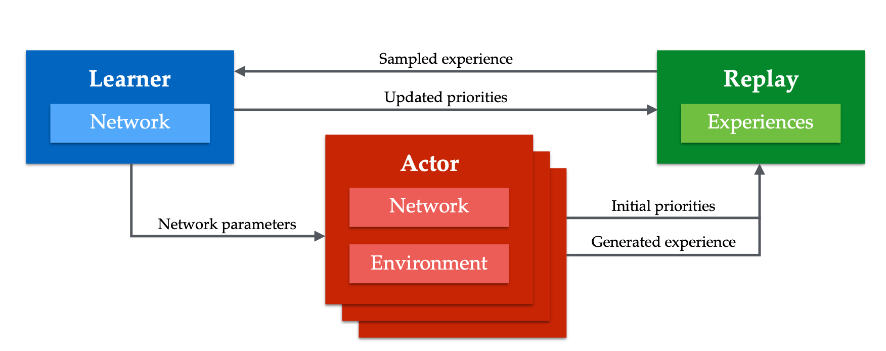
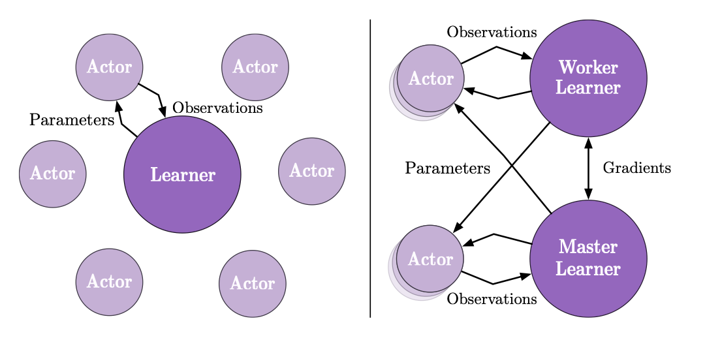

## Apex(Distributed prioritized experience replay)

### PER
在介绍分布式的PER之前，先简单介绍一下原始版本的PER[^1]. PER的提出主要是为了解决如何提高数据利用效率的问题。比方说，一个学生在学习数学的时候，他需要去做题来提高他的理解认知能力。很简单的一个问题就是，学生需要做哪些题目才能更快地提高他的数学能力。直觉上，我们认为去练习那些原来不会做的题目比一直练习已经会做的题目可以更有效率地提高数学水平。PER则是利用来这一点，通过提高和当前认知相差较远的数据（譬如loss很大）的采样概率，降低和当前认知相近的数据的采样概率，来增强算法的学习能力。

具体来讲，在PER中，适应来TD error来衡量能够学习到的内容。直觉上认为从TD error越大的数据中，我们可以学习到更多有效的信息。同时为了提高鲁棒性，并没有直接使用hard的贪心算法，而是引入一个超参数$\alpha$来调节采样的贪心程度，例如，
$$
P(i) = \frac{p_i^\alpha}{\sum_k p_k^\alpha}
$$
对于 $p_i$ 的选取，提出了两种选择方法 $p_i=|\delta_i|+\epsilon$ 或者 $p_i = \frac{1}{\mathrm{rank}(|\delta_i|)}$.(在实现的时候，新收集的数据因为没有TD error，所以会给一个很大的priority，保证能够被选中)。如果我们仔细检查这个过程会发现，有一个严重的问题，就是认为的改变了采样概率，那么最终我们算出来的所有期望值并不会是我们真正想要得到的值。对于这种情况，我们需要引入IS(importance sampling)。
### Importance Sampling
IS 本质是一个很简单的技巧。比如我们想要计算随机变量$f(X)$在分布$p(x)$下的期望值$E_p[f(X)]=\int f(x)p(x)dx$. 但是由于某些原因，我们获得的数据是在分布$q(x)$下获得的，那么我可以做一个简单的变型，通过$q(x)$下的数据依然可以计算出$E_p[f(x)]$。
$$
E_p[f(X)] = \int f(x)p(x)dx = \int [f(x)\frac{p(x)}{q(x)}]q(x) dx
$$
也就是说我们只需要给原始的随机变量$f(X)$一个权重$\frac{p(X)}{q(X)}$即可。

在实际操作过程中，引入一个超参数$\beta$来控制这个权重，例如，
$$
w_i = \left(\frac{1}{N}\frac{1}{P(i)}\right)^{\beta}
$$
为了保证程序的稳定性，通常会乘$\frac{1}{\max_i w_i}$归一化这个权重。显然如果$\beta=1$，那么这个权重可以完全纠正采样分布的偏颇。因此就存一个在priority和correctness之间存在一个tradeoff。在实践过程中，往往通过初始化一个$\beta_0$ 然后慢慢退火到 $1$.
还有一点需要注意的就是IS也会让整个随机梯度下降变得更加的稳定。因为给了大的梯度一个discount，这样更加满足梯度下降所需要的locality。

### Apex
Apex算法则是把上述算法拓展成分布式的结构，如下图。

- Learner 从 Replay之间的采样与反馈加入了priority。
- 相比与单机式的算法，在分布式结构中每个actor需要自己计算出一个初始的priority给新加入的数据。否则如果和单机式的算法一样，给新的数据一个很大的priority的话，会有出现问题。因为在分布式的结构中，我们有很多的actor，那么如果所有的priority都有learner来更新维护，那么learner在每次采样的时候都会选取最近的data。
- 共享数据比共享梯度对于off-policy来讲更加鲁棒。
- 因为分布式的actor，每个都可以探索不同的领域，这样能够更有效解决agent的explore-exploit trade-off.

Apex-DQN
对一般的DQN做了一些修改，使用了DoubleQ和n-step，具体来说，
$$
G_t = R_{t+1} + \gamma R_{t+2} + \cdots + \gamma^{n-1}R_{t+n} + \gamma^n q(S_{t+n}, \arg\max_a q(S_{t+n},a,\theta), \theta^-)
$$
Apex-DDPG
$$
G_t = R_{t+1} + \gamma R_{t+2} + \cdots + \gamma^{n-1}R_{t+n} + \gamma^n q(S_{t+n}, \pi(S_{t+n},\psi^-), \theta^-).
$$

## IMPALA
IMPALA是**Imp**ortance Weighted **A**ctor-**L**earner **A**rchitecture 的缩写。顾名思义，IMPALA框架下，最重要的两个点：
- Importance weight: V-trace
- Actor-Learner 架构：异步

### V-trace
V-trace 可以参考另一篇blog 

### Actor-Learner 

正如上图所示，左边展示的拥有多个actor，一个learner，那么每个actor都把自己采样的数据传给同一个learner，learner使用GPU更新参数。当这种框架扩展到多个actor，多个learner的时候，就如右图所示。一个learner周围有很多actor，比如一个GPU和多个CPU协同，这些actor把自己采样到的数据发送属于自己的learner上去，但是在反向同步参数的时候，actor并不需要一定是从自己对应的learner上去获取参数，而是快速从任意learner获取参数。

## 参考文献
[^1]Schaul, Tom, et al. "Prioritized experience replay." arXiv preprint arXiv:1511.05952 (2015).