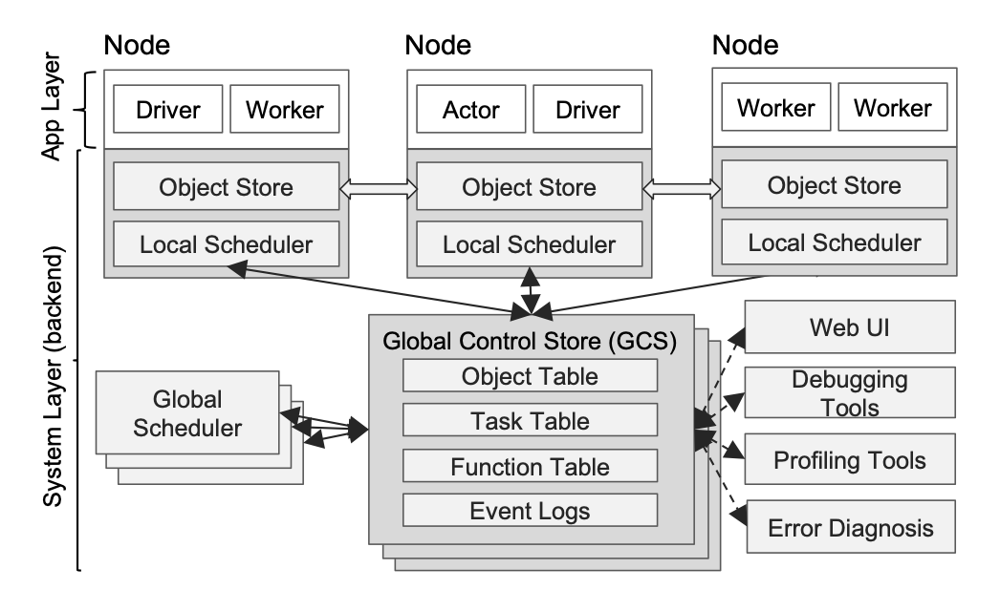

## 摘要
Ray是一个款UCB研究人员设计的分布式机器学习框架，尤其是针对强化学习。本文第一部分介绍分布式机器学习，尤其是对于复杂的强化学习需要解决的几大困难，第二部分介绍Ray框架是如何解决这些问题的。[^1] [^2]

## 问题需要解决
1. 低延迟
2. 高吞吐量
3. 动力学任务创建（Dynamics task creation）
4. 任务的多样性（不同时间尺度，不同能量消耗尺度）
5. 数据流之间的相关性
6. 容错性
7. Debug和其他一些监视要求。

## 动力学计算图
在Ray的框架里，采取了一种成为动力学计算图(Dynamics task graph computation)的计算模式。在Ray里面有三个主要节点：Task, Actor, Data Object。Task用来完成stateless的计算，Actor用来做stateful的计算，Data Object用来存储数据。那么很容易想象这个三者之间都存在某种序的关系，或者所谓的动力学关系。比如一个Task需要另一个Task的输出作为输入，同时随着计算的进行，数据也在不断的更新迭代，那么数据流的方向也具有动力学意义。对于Actor，Ray将其内部的状态的改变也转换成一个有方向的动力学过程。这有点类似把一个自循环的图展开计算。这样Ray的计算图就完全转化成一个无状态的动力学计算图。

## 架构
这边我们介绍Ray是如何架构整个过程来完成上面的计算的并解决问题的。

avatar: /figures/ray/arche.png
整个架构分为两层:App Layer + System Layer.

- App Layer 
    - Driver -> 用来执行用户程序
    - Actor -> 用来执行有状态的程序
    - Worker -> 用来执行无状态的程序

- System Layer
    - Global Control State(GCS) -> Ray独特的设计
        - 解耦lineage和system components，这样在解决容错问题的时候又保证了性能。
        - 把metadata存在GCS里而不是向以往的构架存在scheduler里，这样就解耦了task dispatch和task schedule，保证了性能.
    - Bottom-up Distributed Scheduler -> 为了满足低延迟调度任务，Ray将scheduler分成了两层。
        - Local Scheduler
        - Global Scheduler 
    这样形成先global再local的自下而上的调度方式。
    - In-Memory Distributed Object Store -> 为了降低延迟保证吞吐量，采用了共享内存的存储方式，来降低overhead。

[^1] Moritz, Philipp, et al. "Ray: A distributed framework for emerging {AI} applications." 13th {USENIX} Symposium on Operating Systems Design and Implementation ({OSDI} 18). 2018.
[^2] Nishihara, Robert, et al. "Real-time machine learning: The missing pieces." Proceedings of the 16th Workshop on Hot Topics in Operating Systems. 2017.