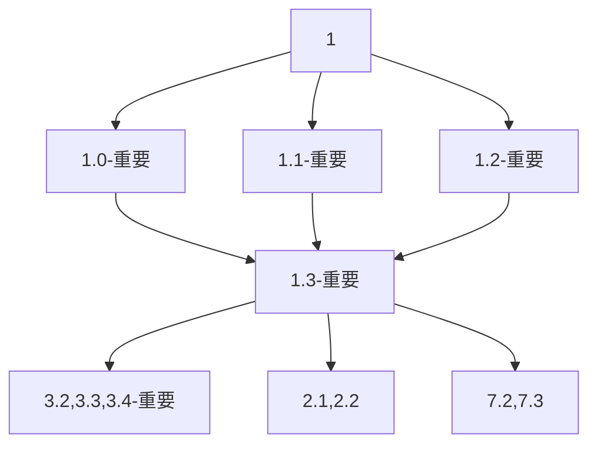
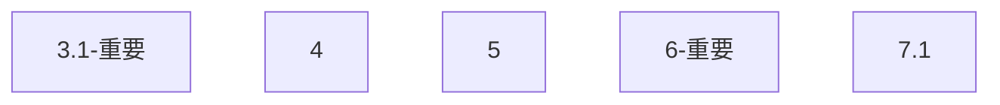

# 3月工作

## 任务列表
1. 评估系统的搭建（最紧急，因为之后的调优基于这些更加综合的指标）
	- 1.0 AIProxy->TDR->指标本地调试过程(fishdai,yeti,alexychen)
	- 1.1 指标开发
		- 1.1.1 基于效能部平台的指标开发（alexychen, juntong, zhichao）
		- 1.1.2 需要从FE里获取的指标开发 (yeti,mingming)
	- 1.2 评估框架的开发（erik，sunny）
		不同于rlbt的模型输入
	- 1.3 两部分的联调(juntong, yeti, erik)

2. 训练录像筛选系统的搭建(erik, yeti, sunny)
	- 2.1 筛选系统的搭建(erik, sunny)
	- 2.2 tag的统计和制定(yeti, alexychen)
	这边的目标是，给录像给多的tag，根据这些tag做筛选。因为录像文件质量参差不齐。尤其之后遇到人类录像文件。
	要解决tag的统计是在哪个模块里比较好。是不是可以复用统计模块或者评估模块。

3. 模型BUG解决(zhichao, alexychen, pengfei)
	- 3.1 打野异常的BUG解决(紧急)（zhichao，alexychen)
	------------下面的优化依赖于评估系统的建成-------------
	- 3.2 使用频率不高技能的释放不准确，不合理
	- 3.3 卡墙bug的监测
	- 3.4 回程BUG
	...

4. 复用模型的开发(这个可以并行但是不紧急，zhichao, alexychen, pengfei, juntong)
	- 4.1 技能和槽位匹配问题(alexychen, 目前基本完成）
	- 4.2 英雄分类，决定哪些英雄共用一个模型
	4.3 

5. 部署事项的开发(gerry, fishdai)

6. rlbt模型基线的建立(pengfei, yeti)
    - 6.0 跑rlbt的统计文件(yeti)
	- 6.1 选取21个英雄，每个位置4个英雄，利用rlbt训练，建立rlbt的模型基线。(pengfei)
    上路: 卡密尔，阿卡丽，剑姬，贾克斯
    打野：奥拉夫，龙女，剑圣，酒桶
    中路：卡牌，炸弹人，小鱼人，发条
    ADC：韦鲁斯，EZ，女枪，烬，卡莎
    辅助：风女，露露，牛头，布隆

7. 模型冗余特征的去除(mingming, pengfei, yongxiang)
	- 7.1 统计目前协议里，有哪些成员FE基本没有填充值，或者填充了一些和语义不相关的值，直接从我们的模型中剔除掉(mingming)
	- 7.2 根据游戏理解或者自动测试算法，来剔除一些干扰的feature(pengfei)
	- 7.3 模型压缩(yongxiang)

## 时间流
串行的开发：

可以并行的开发

## 主要问题讨论
核心需求：
在两到三个星期之内（3月底之前）开发出20-30个左右的核心指标。
核心点：
    - 时间：第一版要在两到三个星期之内开发完成，很多模型的调优工作都依赖于一些核心指标，这个完成不了，后续的工作就无法完成。
    - 目标：第一版只要能够展示就行了，不需要整个框架特别系统，这个可以在后续开发慢慢完善。

需要决定的事项：
- 用不用效能部的框架（我们是否已经开始移植工作了）
    - 是
        - 单纯移植需要多长时间
        - 已经确定了有一些对我们来说的关键指标是从snapshot里面提取不到的，我们需要从FE里去拿，这部分指标嵌入到整个框架里需要多久的工作量。按照我的理解，似乎这部分指标，都不能用agent server？
    - 否
        - 如果我们自己走开发指标，部署一个简易版（能用就好）的框架要多长时间。
