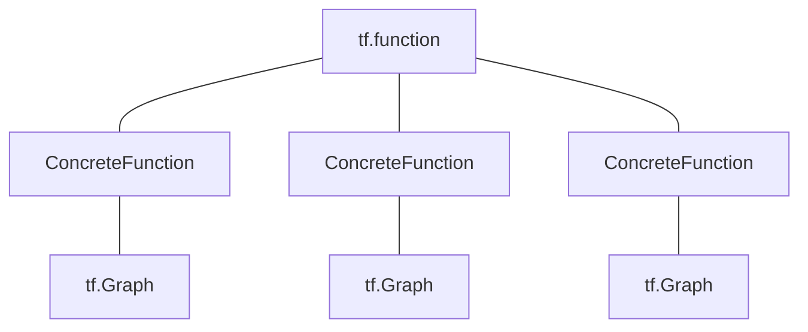

# tf.function简介
## 总体架构

### 原理
一个被```tf.function```修饰的函数，会返回一个```Function```对象，这个对象会管理很多个不同的```ConcreteFunction```。而```ConcreteFunction```是传统的```tf.Graph```一个封装。
- 为什么一个```Function```会管理很多个```ConcreteFunction```？不同于Python的函数自带多态的属性，使用```tf.Graph```来计算的时候，对于相同的操作，也会因为输入的类型或者shape，去构建不同的```tf.Graph```以此提高计算速度。给定一组特定的输入类型和形状，对于一个```Function```，它通过一个```cached key```来确定对应的```ConcreteFunction```。具体来讲```cached key```的规则如下
    * 如果输入对象是```tf.Tensor```,则依赖于数据类型和形状
    * 如果输入对象是```tf.Variable```，则生成一个```id```
    * 对于原生的Python对象，更具值来确定key，对于```List```,```dict```,```tuple```等，则根据展平之后的结果来确定key
    * 对于其他Python对象，则通过```id```来确定key。
- 因此，我们可以直接想象到```Function```的执行分成两步走：
    * Tracing:这一步，和传统的Python代码执行逻辑相似，唯一不同的是，在这个执行过程```Function```并不会立马执行，而是只会生成一个```tf.Graph```，并且推迟到最后一步执行。
    * 执行第一步中被推迟的```tf.Graph```，可以想象的是，这一步的执行速度要远快于第一步。
- 通过上面的分析，我们就可以知道为什么使用```tf.function```可以加速整个计算过程了。因为对于类似输入，比如固定了形状和数据类型，我们整个计算过程只有第一次需要过```tracing```，后面只需要重复执行第二步就好了，而第二步耗时非常短。
### 逻辑转化成图
如果普通的Python函数含有一些逻辑操作，例如条件判断，循环操作等等。使用```@tf.function```修饰，```tensorflow```会根据数据类型判断的是否进行转换。一般的原则，判断逻辑的表达式如果是```tensorflow```里的对象，例如```tf.Tensor```则进行转化，即这些逻辑过程也会进入```tf.Graph```放在第二步执行。否则会被试为普通的Python语句在```tracing```那一步执行。因此可以知道，在一般训练过程，训练数据保存成```tf.data```里面的格式，进行读取，可以帮助我们加速整个过程。否则以Python自带的数据类型或Numpy的格式读入，需要不断重复```tracing```。

## API
- 用装饰符```@tf.function```来把普通函数装饰成一个```Function```
- ```@tf.function```里面有一些参数，可以用来控制```tracing```。
- 可以使用```get_concrete_function```来获取具体的```ConcreteFunction```对象，也是可以获得一个对应的```tf.Graph```。同样我们通过```as_graph_def()```把图序列化，以此来查看图里面的各个节点信息。
- 众所周知，动态图更加方便我们debug，因此在debug的时候，我们可以加上一个flag--```tf.config.run_functions_eagerly(True)```，这样所有的```tf.function```会以动态图的方式运行。